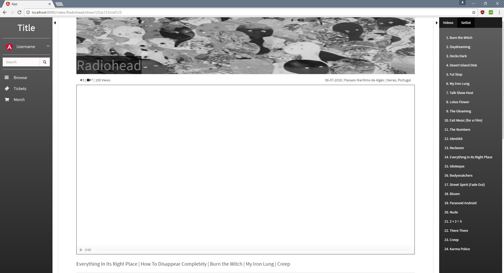
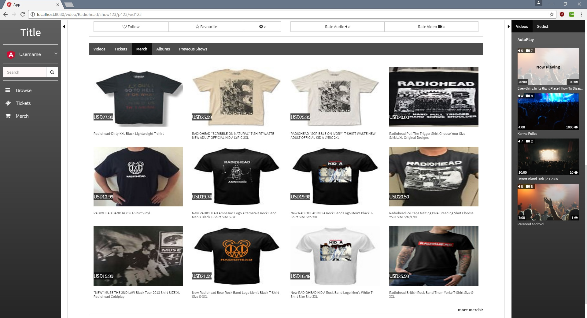
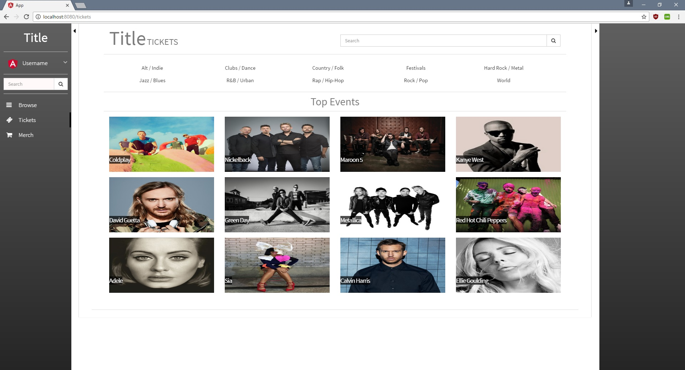

Music App - Angular2
===================

Angular2 with TypeScript version of the music app.

This application allows users to find various details about artists such as:

 - what tickets they have on sale
 - what merch they have available
 - setlists of their previous shows
 - what albums they have released.

----------

Details of each feature
---
Artist Profile
-
- This is a feature page for an individual artist.
- View the artists most popular videos.
- View a small preview of what tickets and merch the artist has available. By clicking the more tickets/merch link under each respective section a search for tickets/merch will be conducted using the artists name.
- A small preview of the artists previous shows and released albums is also shown with links to full pages regarding each section available.

**Note**: All data for top videos is stored locally. Tickets data is loaded via the TicketMaster API. Merch data is loaded via the EBay API. Previous shows data is loaded via the setlist.fm API.
Albums data is loaded via the Spotify API.

 

Artist Videos
-
- Videos for an artist that have been upload by users can be found sorted by the date of the show then by the users that uploaded the videos for each playlist.

**Note**: Data for videos is stored locally.

 

Artist Previous Shows
-
- View a list of all the shows that an artist has previously performed.
- The setlist for each show can be viewed by clicking the setlist field in the table.

**Note**: All data for previous shows and setlists is loaded via the setlist.fm API.

 

Artist Albums
-
- View a list of all the albums that an artist has released, complete with album covers, release years and album tracks.

**Note**: All data for albums is loaded via the Spotify API.

Video Player
-
- View a selected video.
- View the videos in the same playlist and the setlist of the show in the right sidebar.
- View videos, tickets, merch, previous shows and albums by clicking the respective tabs.

**Note**: All data for videos is stored locally. Tickets data is loaded via the TicketMaster API. Merch data is loaded via the EBay API. Previous shows data is loaded via the setlist.fm API.
Albums data is loaded via the Spotify API.

 

Browse
-
- Browse for artists by selecting a genre from the grid and find artists associated with that genre.

**Note**: Data for the genre and artist tiles are stored locally.

 

Tickets
-
- Find tickets from the most popular artists currently on tour on the home tickets screen.
- Search for tickets of a particular genre by clicking one of the genre buttons or enter an artists name into the search bar to find tickets for a specific artist.
- Tickets for an artist can be viewed as a list or on a map provided via Google Maps.

**Note**: Data for the top tickets is stored locally and all other ticket data is loaded from the TicketMaster API.

 

Merch
-
- Find artist merch by searching from the available product categories.
- Search for a specific artists merch via the search bar.
- Filter all results by best match, price ascending and price descending.
- Filter the Apparel page by Mens and Womens.
- Filter the Music page by CDs and Vinyl.

**Note**: All data for merch is loaded via the EBay API.

 

Search
-
- Search for artists using the search bar located on the left sidebar to find artists with the desired name.

**Note**: All data for searching is loaded via the Spotify API.

User Profile
-
- This is a feature page for an individual user.
- View the videos that the user has uploaded, what artists they follow and what videos they have favourited.

**Note**: All data for videos, following and favourites is stored locally.

 

Following
-
- View a list of the artists that you are currently following.

**Note**: All data for following is stored locally.

Upload
-
- Users can upload videos that they have captured from an artists show.
- To upload a video the user must:
  1. Select a file from their file system.
  2. Enter an artists name into the relevant text field.
  3. Enter the year that the show took place.
  4. Select the particular show from which their video was recorded from the shows drop down list.
  5. Select the songs that the artist played in the video from the songs drop down list.
  6. Press the upload button to review the details for the upload and click the terms and conditions check box to upload the video.
- Once the artist name and show year have been entered an api call is made to get the list of shows, then once a show is selected, another api call is made to get the songs played during that show.
- On the My Uploads tab a user can view the videos that they have previously uploaded and select to delete the video.

**Note**: All data for by My Uploads is stored locally. The delete video and cue points arent currently functional and are only for show. Data for uploading a video is loaded from the setlist.fm API.

 

Settings
-
- Users can change their profile and banner pictures, email address and date of birth.
- The user can also change their password and toggle various settings regarding privacy and email notifications.

**Note**: The Login/Logout and Signup features arent currently functional and are only for show.

 

---

Additional Details
-
- Webpack is used as the build system.
- Testing for this application was conducted using Protractor, Jasmine and Karma.

---

**Note**: All api keys have been removed from the project.

To run this application follow the instructions here: https://github.com/preboot/angular-webpack#getting-started

